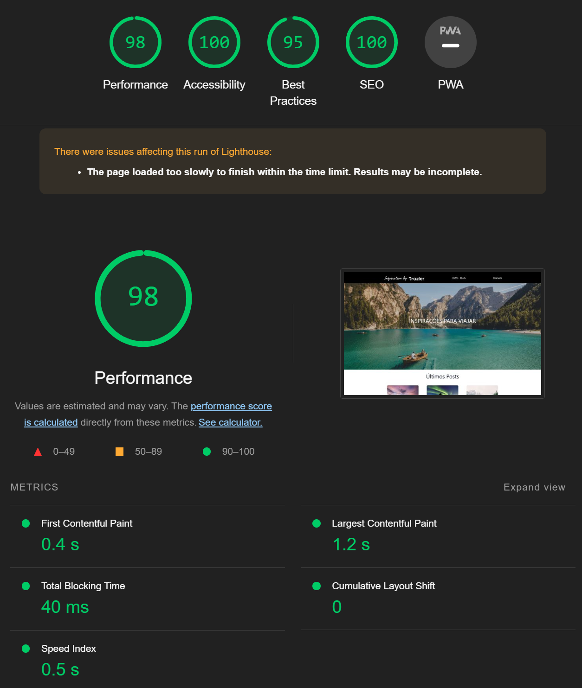

 <h1 align="center">Trazler</h1> 

<p align="center">


</p>

 ## Descrição do projeto 

- Projeto desenvolvido com o framework [***Next.js***](https://nextjs.org/), utilizando [***React***](https://react.dev/) e [***TypeScript***](https://www.typescriptlang.org/) para a matéria de Frontend Jamstack com Next, da [***Pós-Graduação em Desenvolvimento Web Full Stack***](https://posgraduacao.infnet.edu.br/ead/pos-graduacao-desenvolvimento-web-full-stack/) da [***Infnet***](https://www.infnet.edu.br/infnet/home/).

- O projeto consiste de um blog de destinos de viagem com nome fictício de [***Trazler***](https://infnet-projeto-jamstack-next.vercel.app/), com artigos escritos na liguagem de marcação [***.mdx***](https://mdxjs.com/), formulário para inscrição em lista de notificação (*fictícia*), área de login/cadastro e sistema de comentários em post para usuários autenticados.

- Utiliza recursos do [***Google Firebase***](https://firebase.google.com) para cadastro | autenticação de usuários e [***Google Firestore***](https://firebase.google.com/docs/firestore) para armazenamento dos dados.

- Layout responsivo criado com metodologia ***mobile-first*** utilizando [***TailwindCSS***](https://tailwindcss.com/)

- Utiliza pipeline de deploy automático na [***Vercel***](https://vercel.com/) em conjunto com o [***GitHub***](https://github.com/)

## Deploy da aplicação
[Link Trazler na Vercel](https://infnet-projeto-jamstack-next.vercel.app/)

## Teste de Performance do LightHouse
<!--  -->
<p align="center">

</p>

## Instalação do Projeto
### Projeto desenvolvido com Next.js versão 14.

### Requerimentos
[Node.js](https://nodejs.org/en)

### Instalação das dependências
```bash
npm install --legacy-peer-deps
```

### Executar servidor de desenvolvimento
```bash
npm run dev 
```

### Executar build e iniciar servidor de produção
```bash
npm run build
npm run serve 
```